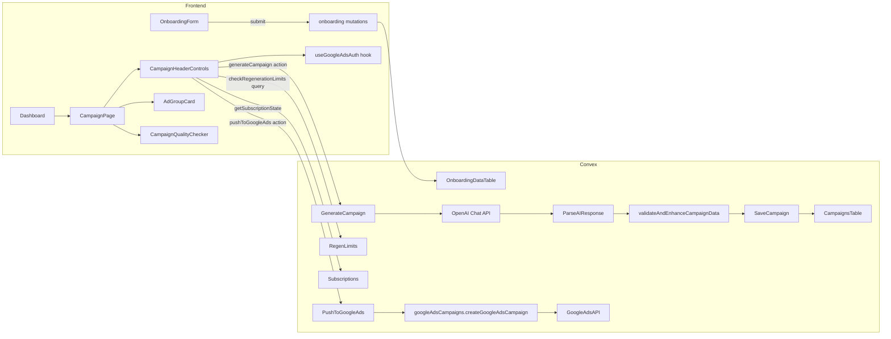
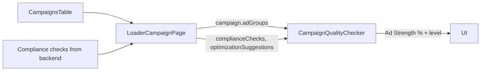

# Ad Quality Improvements – Implementation Plan

This plan turns `tasks/ad-quality-feature-prd.md` into a concrete, code-level implementation guide for the existing Kaizen app. It assumes the current codebase as in:

- Backend: `convex/campaigns.ts`, `convex/googleAds.ts`, `convex/googleAdsCampaigns.ts`, `convex/subscriptions.ts`, `convex/onboarding.ts`
- Frontend: `app/components/campaign/*`, `app/routes/dashboard/*`, `app/lib/useGoogleAdsAuth.ts`

---

## 1. Goals & Non‑Goals

**Primary goals (from PRD, restated for engineers)**

1. **Headline Quality**
   - Each campaign has 4 themed ad groups.
   - **Exactly 12 headlines per ad group** (48 total).
   - Every headline **≤ 30 characters** and **no truncated words** (e.g. never `"Birm"` or `"Londo"`).
   - Headline set covers 5 styles: keyword+city, benefit, value/offer, trust, CTA.

2. **Compliance & Disapprovals**
   - Ads avoid Google’s “Third‑party consumer technical support” policy violations.
   - Copy uses trade‑specific, UK‑compliant language (Gas Safe, Part P) and no embedded phone numbers.

3. **Regeneration & Access Control**
   - **Trial**: 3 total generations (1 initial + 2 regenerations) within a 3‑day window.
   - **Paid**: 3 regenerations per month, plus **60s cooldown** between regenerations.
   - View‑only state when limits/expiry hit; user can still see campaigns but not regenerate/push.

4. **Ad Strength Feedback**
   - In‑app **Ad Strength indicator** that correlates with Google’s “Good/Excellent” behaviour:
     - Based on compliance checks + headline completeness.
     - Encourages fixing issues before pushing to Google Ads.

5. **Dashboard (MVP)**
   - Dashboard shows **status only**:
     - “No campaigns yet” + “Create Your First Campaign →”.
     - “Active campaign” + “View Campaign”.

**Non‑goals in this phase**

- No new dashboard metrics (ROI, CPL, etc.).
- No multiple campaigns per user.
- No fine‑grained manual headline editing; only regeneration.
- No A/B testing or advanced analytics.

---

## 2. Current State vs PRD

### 2.1 Backend – Campaign Generation (`convex/campaigns.ts`)

Already present:

- **Prompting & AI call**
  - `generateCampaign` action builds a rich prompt with:
    - Trade type, services, city, budget, season, compliance instructions.
    - Explicit instructions: **12 headlines**, ≤30 chars, no truncated words, 2–4 descriptions ≤90 chars.
  - Calls OpenAI Chat Completions (`gpt-4-turbo-preview`).

- **Parsing & sanitization**
  - `parseAIResponse`:
    - Extracts JSON from LLM output.
    - Runs `sanitizePhoneNumbers` to strip contaminated phone numbers from nested data.
    - Calls `validateAndEnhanceCampaignData`.
  - `validateAdCopyForPolicyViolations`:
    - Uses `FORBIDDEN_TECH_SUPPORT_PHRASES` and `REQUIRED_TRADE_PHRASES`.
    - Rewrites tech‑support‑ish strings to trade‑specific ones, adds trade/location terms.

- **Headline & description enforcement**
  - `validateAndFixHeadline`:
    - Enforces **≤30 characters**, tries to shorten via:
      - Removing less‑important words (professional, local, expert, etc.).
      - Replacing long words with shorter alternatives (installation→install, emergency→urgent, etc.).
      - Truncates at word boundaries as last resort.
  - `validateAndEnhanceCampaignData`:
    - Maps over all ad groups:
      - Applies `validateAndFixHeadline` to every headline.
      - Ensures **exactly 12** headlines per group using `generateFallbackHeadlines` when needed.
      - Filters descriptions to **≤90 chars**, ensures 2–4 descriptions (adds safe fallbacks if <2).
      - Forces `finalUrl` per ad group from onboarding website URL (or `https://example.com` fallback).
    - Forces `businessInfo.phone` and `callExtensions` to use onboarding phone only.

- **Regeneration limits & cooldown**
  - `checkRegenerationLimits`:
    - Trial: 3 total generations within 3 days of onboarding completion.
    - Paid: 3 regenerations per ~30 days, with a monthly counter and reset date.
    - Cooldown: 60 seconds between regenerations (returns `cooldownSecondsRemaining`).
  - `updateRegenerationTracking`:
    - Increments `regenerationCount`, `monthlyRegenCount`, `lastRegeneration`.

- **Push to Google Ads**
  - `pushToGoogleAds`:
    - Verifies user ownership & authentication.
    - Checks onboarding vs campaign phone consistency and blocks contaminated numbers.
    - Validates URLs for obvious placeholder/invalid values.
    - Enforces subscription/trial before push.
    - Performs deep contamination scan over full campaign object.
    - Delegates to `googleAdsCampaigns.createGoogleAdsCampaign`.

### 2.2 Frontend – Campaign UI

- `CampaignHeaderControls.tsx`
  - Uses `useAction` for `generateCampaign` + `pushToGoogleAds`.
  - Uses `useQuery(api.campaigns.checkRegenerationLimits)` and `useQuery(api.subscriptions.getSubscriptionState)`.
  - Disables buttons when:
    - Regeneration not allowed.
    - Cooldown active.
    - Trial expired or cancelled period ended.
  - Shows:
    - Remaining regenerations (`remaining/3`).
    - Cooldown chip (“Please wait XXs”).
    - Upgrade/Renew CTAs when blocked.

- `CampaignQualityChecker.tsx`
  - Props: `complianceChecks`, `optimizationSuggestions`, `seasonalRecommendations`, `adGroups`.
  - Calculates:
    - `overallScore` = passed / total compliance rules.
    - **Ad Strength**:
      - 70% compliance score.
      - 30% “headline completeness” (percentage of ad groups with exactly 12 headlines).
    - Maps score → level: Excellent / Good / Fair / Poor.
  - Renders:
    - Ad Strength number and badge.
    - Compliance issues & suggestions.
    - Optional Regenerate button (via `onRegenerate` prop).

- `AdGroupCard.tsx`
  - Displays **all headlines**, descriptions, URL, and call extension.
  - Offers “Copy” button to copy combined ad copy.

- Dashboard & settings
  - `app/routes/dashboard/index.tsx` (not shown here) is already simplified per Kaizen defaults:
    - No metrics, only campaign status + CTA.
  - `app/routes/dashboard/google-ads-settings.tsx` surfaces sync telemetry.

**Conclusion:** A **large part of the PRD is already implemented**. The work now is:

- Verify behaviour matches expectations in real campaigns.
- Tighten any gaps (e.g. headline truncation edge cases, regeneration behaviours).
- Make Ad Strength + compliance understandable and reliable for users.

---

## 3. Architecture & Data Flow

### 3.1 High‑Level Flow

### 3.2 Ad Strength Inputs

---

## 4. Detailed Change Plan

This section outlines **what to verify and what to adjust** to fully satisfy the PRD.

### 4.1 Headline Generation & Validation

**Objectives**

- Every ad group has **exactly 12 useful headlines** that:
  - Respect the 30‑character limit (per Google Ads docs).
  - Never show visibly truncated words to the user.
  - Cover the variety required by the PRD.

**Planned work**

1. **Centralize length constants**
   - In `convex/campaigns.ts`, define:
     - `const MAX_HEADLINE_CHARS = 30;`
     - `const MAX_DESCRIPTION_CHARS = 90;`
   - Replace magic numbers in `validateAndFixHeadline` and description filtering with these constants.

2. **Audit & harden `validateAndFixHeadline`**
   - Confirm it:
     - Iteratively removes low‑value words and applies replacements *before* any truncation.
     - Only truncates at word boundaries: last space before max length.
     - Emits `console.warn` when forced to truncate a single long word (should be rare).
   - If we still see issues like `"Birm"`/`"Londo"` in real data, add an extra guard:
     - After generating candidate headline, split into words and drop any final word that is clearly a prefix of a known city (optional enhancement).

3. **Guarantee headline count & quality per ad group**
   - In `validateAndEnhanceCampaignData`:
     - Keep existing logic that:
       - Maps each `adGroup.adCopy.headlines` through `validateAndFixHeadline`.
       - When `headlines.length < 12`, calls `generateFallbackHeadlines` and tops up to 12.
       - When `headlines.length > 12`, truncates with warning.
   - Review `generateFallbackHeadlines` templates to ensure:
     - They always include clear trade and city context.
     - They are short enough to survive `validateAndFixHeadline` without losing meaning.

4. **Descriptions**
   - Keep current filtering and fallback behaviour:
     - Filter to `<= MAX_DESCRIPTION_CHARS`.
     - Add at least 2, max 4 descriptions per ad group.
   - Optionally, tweak fallback text to be closer to PRD examples (“Local emergency plumber”, “Gas Safe registered”, etc.).

5. **Policy & phone sanitization (already implemented, just verify)**
   - Ensure `parseAIResponse` always runs `sanitizePhoneNumbers` and `validateAdCopyForPolicyViolations` for all ad groups.
   - Spot‑check example AI responses in logs:
     - Confirm any phone patterns are replaced with neutral phrases like `"Call Now"`.
     - Confirm generic “tech support” phrases get rewritten to trade‑specific wording.

### 4.2 Regeneration Limits & Trial / Subscription Gating

**Objectives**

- Behaviour exactly matches PRD numbers:
  - 3 generations in trial (3 days).
  - 3 regenerations/month for paid.
  - 60s cooldown between regenerations.
  - Clear, consistent UI state when blocked.

**Planned work**

1. **Backend verification**
   - **Trial logic** in `checkRegenerationLimits`:
     - Confirm `regenerationCount` includes the initial campaign created after onboarding.
     - Ensure `remainingTrialRegens = max(0, 3 - regenerationCount)` matches PRD.
   - **Paid logic**:
     - Verify calendar‑month vs rolling‑30‑day behaviour; current code uses a 30‑day comparison.
     - Decide and document whether this is acceptable or if we need a true calendar month reset.
   - **Cooldown**:
     - Confirm `lastRegeneration` is updated only on successful generation (`updateRegenerationTracking`).

2. **Frontend gating (`CampaignHeaderControls`)**
   - Confirm all paths that trigger regeneration call `generateCampaign` and therefore go through `checkRegenerationLimits`.
   - Ensure `AnimatedGenerateButton` for regeneration is disabled when:
     - `regenerationLimits.allowed === false`, or
     - `cooldownSeconds > 0`, or
     - `subscriptionState.isTrialExpired` or `subscriptionState.isCancelledPeriodEnded`.
   - Keep existing UI copy but align with PRD where needed (e.g. “Trial limit reached (3 total generations)”).

3. **View‑only state**
   - Validate that, when blocked:
     - Campaign page still displays `AdGroupCard`, `CampaignQualityChecker`, etc.
     - Only **mutating** actions (Regenerate, Push, Edit settings where applicable) are disabled.

### 4.3 Access Control – Subscription & Auto‑Pause

**Objectives**

- Users cannot push new campaigns when trial is expired or subscription is inactive.
- Eventually, Google Ads campaigns are paused when subscription lapses.

**Planned work**

1. **Push gating**
   - Already enforced in `pushToGoogleAds`:
     - Checks `fetchUserSubscription` + onboarding completion date.
   - Ensure copy in `CampaignHeaderControls.handlePushToGoogleAds` matches backend reasons (“Trial expired or subscription inactive…”).

2. **Auto‑pause (follow‑up design)**
   - (Optional for this iteration; document as future work):
     - Add an action `pauseGoogleAdsCampaignsForUser` in `googleAdsCampaigns.ts` that:
       - Looks up all campaigns with `googleCampaignId` for a user.
       - Calls Google Ads API to pause them.
     - Hook this into subscription status changes in `convex/subscriptions.ts` or a scheduled job.

### 4.4 Ad Strength & Quality Checker

**Objectives**

- Make Ad Strength a reliable proxy for:
  - Compliance correctness.
  - Headline completeness (12/12 per group).

**Planned work**

1. **Ensure `CampaignQualityChecker` gets full data**
   - In the route that renders the campaign page, pass:
     - `adGroups` from `campaign.adGroups`.
     - `complianceChecks` from backend (likely derived from `ukComplianceRules`).
     - `optimizationSuggestions` & `seasonalRecommendations` from campaign doc (if present).

2. **Explain Ad Strength to the user**
   - In `CampaignQualityChecker` description, clarify:
     - “Ad Strength is based on UK compliance rules and whether each ad group has 12 complete headlines.”

3. **Acceptance levels**
   - Keep current thresholds:
     - ≥90 → Excellent.
     - ≥75 → Good.
   - Align PRD success metric with these thresholds and document that “Goal is ≥75 (Good) or ≥90 (Excellent) in app’s Ad Strength”.

### 4.5 Dashboard (MVP) & Settings

**Objectives**

- Dashboard remains simple and status‑only.

**Planned work**

1. **Dashboard index route**
   - Verify it:
     - Uses `getCampaign` to detect existence.
     - Renders either:
       - “No campaigns yet” + “Create Your First Campaign →”.
       - “Active campaign” + “View Campaign”.
   - Confirm no metric charts or financial KPIs show up.

2. **Google Ads settings page**
   - `google-ads-settings.tsx` already renders sync telemetry via `SyncStatusComponent`.
   - No additional work needed for Ad Quality, aside from any copy tweaks.

---

## 5. Manual Testing Strategy

This is the **checklist to validate the implementation**. Run in staging/dev with real Google Ads sandbox where possible.

### 5.1 Headline Quality & Variety

1. **Plumber only – typical city**
   - Onboarding:
     - Trade: Plumbing.
     - Services: Emergency Plumbing, Boiler Repair, Leak Repair, etc.
     - City: “Birmingham”.
     - Provide real website URL.
   - Generate campaign:
     - Confirm 4 ad groups (matching themes present in `SERVICE_TO_THEME_MAP`).
     - For each ad group:
       - Count 12 headlines in `AdGroupCard`.
       - Spot‑check string lengths (manually or via console) ≤ 30.
       - Ensure no visible truncated words (“Birm”, “Londo”, “Emergen”).
       - Confirm at least 2 descriptions, each ≤90 chars.

2. **Electrician only – long city names**
   - Repeat with:
     - Trade: Electrical.
     - City: “Stoke-on-Trent”.
   - Verify that:
     - Headlines still ≤30 chars and remain readable.
     - City might be abbreviated or omitted where necessary, but no mid‑word truncation.

3. **Both trades**
   - Trade: Both; pick mixed plumbing/electrical services.
   - Ensure:
     - Ad groups only created for themes backed by actual services from onboarding.
     - Keywords and copy don’t refer to services outside their theme.

### 5.2 Regeneration & Cooldown

1. **Trial behaviour**
   - Fresh user (no subscription).
   - Complete onboarding → confirm initial campaign is created automatically.
   - Click “Regenerate Campaign” twice:
     - Both succeed; `remaining` counter decreases.
   - Third additional attempt:
     - Button disabled or toast shows “Trial limit reached (3 total generations)…”.

2. **Cooldown**
   - After a regeneration, try again immediately:
     - Expect a toast “Please wait XX seconds…” and cooldown chip in UI.
     - After 60 seconds, attempt succeeds.

3. **Paid behaviour**
   - Mark user subscription as active in `subscriptions` table.
   - Regenerate 3 times within a short window:
     - 4th attempt blocked with message including next reset date.

### 5.3 Access Control & View‑Only

1. **Trial expired**
   - Set onboarding `completedAt` to >3 days ago.
   - Load campaign page:
     - Regenerate and Push buttons disabled; Upgrade CTA visible.
     - Campaign content still visible.

2. **Cancelled subscription**
   - Set subscription to `cancelled` with `billingPeriodEndsAt` in the future:
     - Until end date: full access; info banner warns about upcoming end.
     - After date (set `isCancelledPeriodEnded` true): behaves like expired subscription.

### 5.4 Google Ads Push & Safety

1. **Happy path**
   - Connect Google Ads via OAuth.
   - Ensure onboarding phone + website are valid.
   - Push campaign:
     - Confirm no errors in console logs during pre‑push validation.
     - Confirm Google Ads campaign + ad groups + RSAs appear in test account.
     - In Google Ads UI, check Ad Strength (target: Good/Excellent).

2. **Placeholder URL**
   - Use `https://example.com` as website.
   - Confirm pre‑push logs a warning and (in production) blocks push with meaningful error message.

3. **Contaminated phone number**
   - (For QA only) Manually inject a known bad phone into campaign doc.
   - Try push:
     - Expect push to be blocked with descriptive error pointing to mismatch/contamination.

---

## 6. Open Questions / Decisions to Finalize

1. **Monthly reset semantics**
   - Is “30 days since last reset” acceptable, or should we switch to calendar‑month resets (1st of each month)?
2. **Minimum headlines for Good vs Excellent**
   - Currently, Ad Strength uses 70/30 weighting; is this enough, or should we require 100% of ad groups to have 12 headlines for “Excellent”?
3. **Auto‑pause timing**
   - When exactly should Google Ads campaigns be paused after subscription lapse:
     - Immediately on status change?
     - After a short grace period?
4. **Analytics feedback loop**
   - In a later phase, should we use real Ad Strength from Google Ads API to calibrate our in‑app score?

This plan should give any engineer enough detail to implement, verify, and iterate on the Ad Quality feature while staying aligned with the PRD and the existing codebase.

