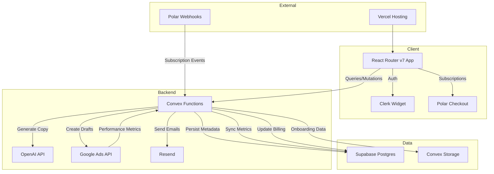

# System Architecture

```mermaid
graph TD
  subgraph Client
    A[React Router v7 App]
    B[Clerk Widget]
    C[Polar Checkout]
  end

  subgraph Backend
    D[Convex Functions]
    E[OpenAI API]
    F[Google Ads API]
    G[Resend]
  end

  subgraph Data
    H[Supabase Postgres]
    I[Convex Storage]
  end

  subgraph External
    J[Vercel Hosting]
    K[Polar Webhooks]
  end

  A -->|Auth| B
  A -->|Subscriptions| C
  A -->|Queries/Mutations| D
  D -->|Onboarding Data| I
  D -->|Persist Metadata| H
  D -->|Generate Copy| E
  D -->|Create Drafts| F
  D -->|Send Emails| G
  F -->|Performance Metrics| D
  D -->|Sync Metrics| H
  K -->|Subscription Events| D
  D -->|Update Billing| H
  J --> A
```

