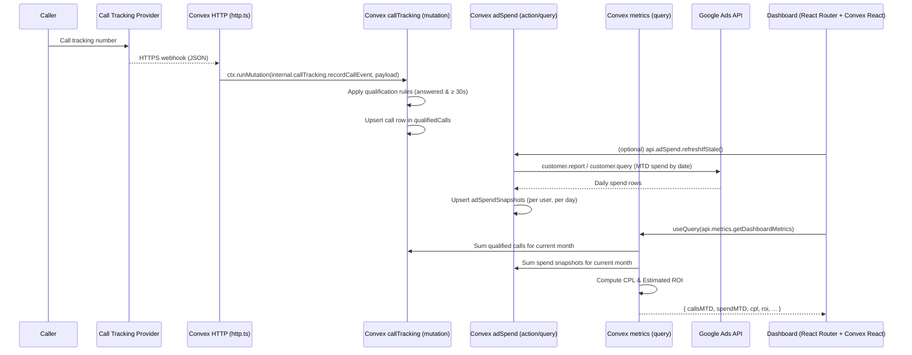

## Real-Time Dashboard Metrics – Feature Plan

### 1. Scope & Objectives

- **Feature**: Real-time dashboard metrics for TradeBoost AI dashboard (`/dashboard`).
- **Primary metrics** (current month, user’s timezone):
  - **Qualified Calls** (answered, ≥ 30s).
  - **Ad Spend (MTD)** (Google Ads).
  - **Cost Per Lead** = Ad Spend ÷ Qualified Calls (N/A when 0 calls).
- **Secondary metric**:
  - **Estimated ROI** = (Qualified Calls × Average Revenue Per Job) − Ad Spend.
- **Target placement**:
  - Main tiles rendered via `OverviewCard` on `dashboard/index.tsx`.
  - Estimated ROI displayed as subtext / summary below tiles and in the “Bottom Line” section.

This plan is **implementation-ready** for this codebase: Convex backend, React Router v7 (framework mode), Clerk auth, Tailwind UI, and existing Google Ads integration (`google-ads-api`).

### 2. Open Questions & Assumptions

These are the **key things I need from you** to fully lock requirements. Until then, the plan below uses the assumptions in **italics**.

- **Call tracking provider**
  - Q: Which provider will we use first (Twilio, CallRail, other)?
  - Assumption: *First implementation will target a single provider (probably Twilio-like JSON payload); webhook handler will be structured so we can easily plug in a second provider.*
- **Tracking numbers**
  - Q: Should tracking numbers be **per user**, **per campaign**, or both?
  - Assumption: *MVP: one primary tracking number per user; optional later expansion to per-campaign.*
- **Average Revenue Per Job source**
  - Q: Are you OK reusing `onboardingData.acquisitionGoals.averageJobValue` as “Average Revenue Per Job”?
  - Assumption: *Yes; we only change **labels/tooltips**, not the schema field name.*
- **Estimated ROI display format**
  - Q: Do you want **money only** (per PRD) or money + percentage (e.g. “£744.50 (340%)”)?
  - Assumption: *Primary display is **money**, percentage can appear as supporting text (“340% ROI”) where it’s already shown.*
- **Timezone handling**
  - Q: Do we treat all users as UK (e.g. `Europe/London`) for now, or capture a per-user timezone?
  - Assumption: *Short term: default to `Europe/London`; we design the API to accept a user timezone field so it’s easy to extend.*
- **Demo mode / empty state**
  - Q: Do you want a “demo data” mode for brand-new users with no calls/spend yet?
  - Assumption: *MVP: simple “Getting started” empty state + optional toggle to show demo numbers; real implementation later.*

Please confirm / adjust these; the rest of the plan doesn’t require immediate answers but I’ll highlight spots where behavior is explicitly “TBD”.

---

### 3. Architecture Overview

#### 3.1 High-Level Flow

- **Call-side (qualified calls)**
  - Call tracking provider sends **webhook** → Convex **HTTP action** (`convex/http.ts`).
  - HTTP action parses & validates payload, verifies signature, then calls an **internal mutation** to:
    - Insert a **call record**.
    - Mark it as **qualified** if answered and duration ≥ 30s.
  - Convex reactivity: any client using `useQuery(api.metrics.getDashboardMetrics, {})` gets live updates.

- **Ad spend (MTD)**
  - On-demand or scheduled Convex **action** uses `GoogleAdsApi` (from `google-ads-api`) with the user’s refresh token from `googleAdsTokens`.
  - It issues a **report** / GAQL query for the current month date range, segmented by day.
  - Results are saved as **daily spend snapshots** in Convex.
  - A metrics query sums per-user daily spend to produce **MTD ad spend**.

- **Metrics aggregation**
  - A Convex **query** `metrics.getDashboardMetrics`:
    - Reads **qualified calls** for current month.
    - Reads **ad spend snapshots** for current month.
    - Reads **Average Revenue Per Job** from onboarding / settings.
    - Returns: Qualified Calls (MTD), Ad Spend (MTD), Cost Per Lead, Estimated ROI, timestamps, and flags (`hasRealData`, `isDemo`, etc.).

- **Frontend**
  - `dashboard/index.tsx` uses `useQuery(api.metrics.getDashboardMetrics)` to get **live data**.
  - It maps metrics into the existing `OverviewCard` props and updates the “Quick Summary” and “Bottom Line” components.
  - Tailwind styling stays inside existing components; no business logic in UI.

#### 3.2 End-to-End Diagram



---

### 4. Data Model Changes (Convex Schema)

We extend `convex/schema.ts` with **three new tables** and **optional config**:

#### 4.1 `qualifiedCalls`

Stores **all call events** we consider for qualification, with enough metadata to debug and re-aggregate if rules change.

```ts
qualifiedCalls: defineTable({
  userId: v.string(),
  provider: v.string(),            // "twilio", "callrail", etc.
  externalCallId: v.string(),      // provider’s unique ID (for idempotency)
  fromNumber: v.optional(v.string()),
  toNumber: v.optional(v.string()),
  trackingNumber: v.optional(v.string()),
  startedAt: v.number(),           // ms since epoch (raw event time, in UTC)
  durationSeconds: v.number(),
  answered: v.boolean(),
  qualificationStatus: v.string(), // "qualified" | "unqualified"
  qualificationReason: v.optional(v.string()),
  createdAt: v.number(),
})
  .index("by_user", ["userId"])
  .index("by_user_and_start", ["userId", "startedAt"])
  .index("by_external_id", ["provider", "externalCallId"]),
```

Notes:
- We **never delete** rows on qualification changes; if rules change we can re-run an internal migration.
- Qualification rule (answered & duration ≥ 30s) lives in a single internal mutation.

#### 4.2 `adSpendSnapshots`

Stores **daily** Google Ads spend per user for quick MTD aggregation.

```ts
adSpendSnapshots: defineTable({
  userId: v.string(),
  date: v.string(),             // "YYYY-MM-DD" in user's timezone
  currencyCode: v.string(),     // e.g. "GBP" or "USD"
  spendMicros: v.number(),      // raw micros from Google Ads
  syncedAt: v.number(),         // ms epoch when we last synced this date
  source: v.string(),           // "google_ads"
  googleCustomerId: v.optional(v.string()),
  rawError: v.optional(v.string()), // last sync error if any
})
  .index("by_user_date", ["userId", "date"])
  .index("by_user", ["userId"]),
```

We **always** store micros from Google Ads and convert to currency in queries / UI.

#### 4.3 `metricsCache` (optional but recommended)

For performance (and future charts), we can cache the latest computed metrics per user + month. Not strictly required for MVP but easy to add.

```ts
metricsCache: defineTable({
  userId: v.string(),
  monthKey: v.string(),     // "YYYY-MM" in user's timezone
  callsQualified: v.number(),
  adSpendMicros: v.number(),
  averageRevenuePerJob: v.number(),
  estimatedRoiMicros: v.number(), // ROI money in micros
  lastComputedAt: v.number(),
})
  .index("by_user_month", ["userId, monthKey"]),
```

In MVP, we can **skip** this table and compute metrics on the fly; we keep it in the plan as an optimization hook.

#### 4.4 User-configurable “Average Revenue Per Job”

Current schema (**existing**):

```ts
// convex/schema.ts
acquisitionGoals: v.optional(v.object({
  monthlyLeads: v.number(),
  averageJobValue: v.number(),
  monthlyBudget: v.number(),
})),
```

Plan:
- **Reuse** `acquisitionGoals.averageJobValue` as “Average Revenue Per Job (ARJ)” for ROI calculations.
- UI changes (onboarding + settings) simply **rename & explain**:
  - Label: “Average Revenue Per Job”.
  - Tooltip: “Used to estimate ROI. We currently assume 1 qualified call ≈ 1 job.”

If you want a dedicated settings table later (e.g. per-category ARJ), we can add a `userSettings` table, but that’s **out of MVP scope**.

---

### 5. Backend APIs (Convex)

#### 5.1 Call Tracking – `convex/callTracking.ts`

New module responsible for **normalizing** provider webhooks and **enforcing** qualification rules.

**5.1.1 Internal mutation: `internal.callTracking.recordCallEvent`**

Responsibilities:
- Enforce **idempotency** via `(provider, externalCallId)` index.
- Compute `qualificationStatus` and `qualificationReason`.
- Insert row into `qualifiedCalls`.

Pseudocode:

```ts
// convex/callTracking.ts
import { internalMutation } from "./_generated/server";
import { v } from "convex/values";

export const recordCallEvent = internalMutation({
  args: {
    userId: v.string(),
    provider: v.string(),
    externalCallId: v.string(),
    fromNumber: v.optional(v.string()),
    toNumber: v.optional(v.string()),
    trackingNumber: v.optional(v.string()),
    startedAt: v.number(),       // ms epoch UTC
    durationSeconds: v.number(),
    answered: v.boolean(),
  },
  async handler(ctx, args) {
    const existing = await ctx.db
      .query("qualifiedCalls")
      .withIndex("by_external_id", q =>
        q.eq("provider", args.provider).eq("externalCallId", args.externalCallId),
      )
      .first();
    if (existing) return existing._id; // idempotent

    const qualified =
      args.answered && args.durationSeconds >= 30;

    const qualificationStatus = qualified ? "qualified" : "unqualified";
    const reason = !args.answered
      ? "not_answered"
      : args.durationSeconds < 30
      ? "short_duration"
      : "rules_satisfied";

    return await ctx.db.insert("qualifiedCalls", {
      ...args,
      qualificationStatus,
      qualificationReason: reason,
      createdAt: Date.now(),
    });
  },
});
```

No provider-specific logic here beyond interpreting basic common fields. Provider-specific parsing happens in HTTP actions.

#### 5.2 HTTP Webhook – `convex/http.ts`

We extend the **existing** `httpRouter` to add a call tracking webhook route.

**5.2.1 Route: `POST /call-tracking/webhook`**

- New `httpAction` that:
  - Verifies provider signature (HMAC secret / auth header).
  - Maps provider payload → `recordCallEvent` args.
  - Returns `200` quickly to avoid provider timeouts.

Example stub:

```ts
// convex/http.ts
import { httpRouter } from "convex/server";
import { httpAction } from "./_generated/server";
import { internal } from "./_generated/api";

// existing routes...

http.route({
  path: "/call-tracking/webhook",
  method: "POST",
  handler: httpAction(async (ctx, req) => {
    const provider = "twilio"; // or infer from headers / path

    // TODO: verify signature from headers
    const raw = await req.json();

    // TODO: map raw payload -> normalized values (provider-specific)
    const normalized = mapProviderPayload(raw, provider);

    await ctx.runMutation(internal.callTracking.recordCallEvent, normalized);

    return new Response(null, { status: 200 });
  }),
});
```

`mapProviderPayload` is intentionally **pure** and easy to unit-test (no Convex context).

#### 5.3 Ad Spend Sync – `convex/adSpend.ts`

New module to **fetch**, **normalize**, and **store** Google Ads spend per day.

**5.3.1 Helper: build Google Ads client from existing tokens**

We already store tokens in `googleAdsTokens` (`convex/googleAds.ts`) and use `google-ads-api` in `googleAdsCampaigns.ts`. We reuse that pattern here.

Key doc references:
- `GoogleAdsApi` client setup.
- `customer.report({ entity: "campaign", metrics: [...], segments: ["segments.date"], from_date, to_date })`.

The adapter will:
- Use `process.env.VITE_GOOGLE_CLIENT_ID`, `GOOGLE_CLIENT_SECRET`, `GOOGLE_ADS_DEVELOPER_TOKEN`, `GOOGLE_ADS_MANAGER_ACCOUNT_ID` (already used).
- Use customer ID associated with the user (for MVP it can be a single manager account if you already use that pattern; if not, we’ll need a per-user mapping later).

**5.3.2 Action: `adSpend.refreshCurrentMonthIfStale`**

Responsibilities:
- Ensure MTD spend is **fresh within 10–15 minutes** without hammering the API.
- Run only when:
  - Called explicitly from dashboard **or**
  - Later: scheduled via external cron / Convex crons.

Pseudocode:

```ts
// convex/adSpend.ts
import { action } from "./_generated/server";
import { api } from "./_generated/api";
import { GoogleAdsApi, enums } from "google-ads-api";

export const refreshCurrentMonthIfStale = action({
  args: {},
  async handler(ctx) {
    const userId = await getCurrentUserToken(ctx); // same helper as googleAds.ts
    if (!userId) throw new Error("User not authenticated");

    // 1) Check last syncedAt for this month
    const { monthKey, todayDates } = computeMonthDatesForUser(/* timezone TBD */);
    const latestSnapshot = await getLatestSnapshotForUserMonth(ctx, userId, monthKey);
    const now = Date.now();
    const fifteenMinutesMs = 15 * 60 * 1000;

    if (latestSnapshot && now - latestSnapshot.syncedAt < fifteenMinutesMs) {
      return { skipped: true, reason: "fresh_enough" };
    }

    // 2) Build Google Ads customer client (similar to googleAdsCampaigns.ts)
    const tokens = await ctx.runQuery(api.googleAds.getTokens, {});
    if (!tokens || !tokens.refreshToken) {
      throw new Error("Google Ads not connected");
    }

    const client = new GoogleAdsApi({
      client_id: process.env.VITE_GOOGLE_CLIENT_ID!,
      client_secret: process.env.GOOGLE_CLIENT_SECRET!,
      developer_token: process.env.GOOGLE_ADS_DEVELOPER_TOKEN!,
    });

    const customer = client.Customer({
      customer_id: process.env.GOOGLE_ADS_MANAGER_ACCOUNT_ID!.replace(/-/g, ""),
      refresh_token: tokens.refreshToken,
    });

    // 3) Fetch daily spend for current month
    const from_date = todayDates.firstOfMonth; // "YYYY-MM-DD"
    const to_date = todayDates.today;         // "YYYY-MM-DD"

    const rows = await customer.report({
      entity: "customer",
      metrics: ["metrics.cost_micros"],
      segments: ["segments.date"],
      from_date,
      to_date,
    });

    // 4) Upsert adSpendSnapshots per day
    for (const row of rows) {
      const date = row.segments.date; // "YYYY-MM-DD"
      const spendMicros = row.metrics.cost_micros;
      await upsertDailySpend(ctx, {
        userId,
        date,
        currencyCode: "GBP", // or from account, TBD
        spendMicros,
      });
    }

    return { skipped: false, days: rows.length };
  },
});
```

For MVP, we call this from the dashboard (once per user per ~15 minutes) instead of adding a Convex crons dependency.

#### 5.4 Metrics API – `convex/metrics.ts`

Central place to answer “what should the dashboard show for this user right now?”

**5.4.1 Query: `metrics.getDashboardMetrics`**

Responsibilities:
- Determine current month date range for **user’s timezone** (TBD; default `Europe/London`).
- Aggregate:
  - Qualified calls count.
  - Ad spend for current month (sum of `spendMicros`).
- Compute:
  - Cost Per Lead (CPL).
  - Estimated ROI.
- Return data shaped exactly for the dashboard.

Pseudocode:

```ts
// convex/metrics.ts
import { query } from "./_generated/server";
import { v } from "convex/values";

export const getDashboardMetrics = query({
  args: {},
  async handler(ctx) {
    const userId = await getCurrentUserToken(ctx);
    if (!userId) throw new Error("User not authenticated");

    const { monthKey, monthStart, monthEnd, todayDate } =
      computeMonthDatesForUser(/* timezone TBD */);

    // Qualified calls MTD
    const calls = await ctx.db
      .query("qualifiedCalls")
      .withIndex("by_user_and_start", q =>
        q.eq("userId", userId)
          .gte("startedAt", monthStart)
          .lt("startedAt", monthEnd),
      )
      .collect();

    const qualifiedCalls = calls.filter(
      c => c.qualificationStatus === "qualified",
    ).length;

    // Ad spend MTD
    const spendSnapshots = await ctx.db
      .query("adSpendSnapshots")
      .withIndex("by_user", q => q.eq("userId", userId))
      .collect();

    const mtdSpendMicros = spendSnapshots
      .filter(s => s.date >= monthKey + "-01" && s.date <= todayDate)
      .reduce((sum, s) => sum + s.spendMicros, 0);

    // Average revenue per job from onboarding
    const onboarding = await ctx.db
      .query("onboardingData")
      .withIndex("userId", q => q.eq("userId", userId))
      .first();

    const averageRevenuePerJob =
      onboarding?.acquisitionGoals?.averageJobValue ?? 0;

    // Calculations (convert micros -> currency in JS)
    const spend = mtdSpendMicros / 1_000_000; // micros → major units
    const cpl =
      qualifiedCalls > 0 ? spend / qualifiedCalls : null;
    const estimatedRevenue = qualifiedCalls * averageRevenuePerJob;
    const estimatedRoi = estimatedRevenue - spend;

    const now = Date.now();

    return {
      timeRange: {
        monthKey,
        start: monthStart,
        end: monthEnd,
      },
      qualifiedCalls,
      adSpend: {
        amount: spend,
        currencyCode: "GBP", // or from account, TBD
      },
      costPerLead: cpl, // null => "N/A"
      estimatedRoi: estimatedRoi,
      lastUpdatedAt: now,
      hasRealData: qualifiedCalls > 0 || spend > 0,
    };
  },
});
```

We deliberately **do not** include any UI formatting (e.g. “£89.50”) here; formatting belongs to the frontend.

---

### 6. Frontend Integration (React Router v7 + Convex React)

#### 6.1 Data fetching in `dashboard/index.tsx`

Current route is a **client component** (`"use client";`) that uses hard-coded stats. We replace those hard-coded values with Convex data while keeping the same component structure.

**6.1.1 Add Convex query usage**

Key changes:
- Import `useQuery` and `api`:

```tsx
// app/routes/dashboard/index.tsx
import { useQuery } from "convex/react";
import { api } from "../../../convex/_generated/api";
```

- Call the metrics query:

```tsx
const metrics = useQuery(api.metrics.getDashboardMetrics) ?? null;
```

- Derive safe values with good fallbacks:

```tsx
const qualifiedCalls = metrics?.qualifiedCalls ?? 0;
const adSpend = metrics?.adSpend.amount ?? 0;
const costPerLead = metrics?.costPerLead ?? null;
const estimatedRoi = metrics?.estimatedRoi ?? 0;
const lastUpdated = metrics?.lastUpdatedAt
  ? new Date(metrics.lastUpdatedAt)
  : null;
```

We should **keep** a graceful empty state:
- When `metrics === undefined` → **loading** state.
- When `metrics && !metrics.hasRealData` → “Setting up…” state per PRD (0 calls / 0 spend).

#### 6.2 Wiring into `OverviewCard`

Existing `OverviewCard` expects:

```ts
stats: Array<{
  label: string;
  value: string | number;
  change?: string;
  changeType?: "positive" | "negative";
}>;
```

We map as:

```tsx
const overviewStats = metrics
  ? [
      {
        label: "Qualified Calls",
        value: qualifiedCalls,
        // (optional) later: change vs yesterday/last week
      },
      {
        label: "Ad Spend (MTD)",
        value: formatCurrency(adSpend),
      },
      {
        label: "Cost Per Lead",
        value: costPerLead != null ? formatCurrency(costPerLead) : "N/A",
      },
    ]
  : // loading skeleton
    [
      { label: "Qualified Calls", value: "…" },
      { label: "Ad Spend (MTD)", value: "…" },
      { label: "Cost Per Lead", value: "…" },
    ];
```

We can re-use a small `formatCurrency` helper (either local to the route or from `app/lib/utils.ts`) that respects locale and currency.

#### 6.3 Estimated ROI display

In the “Quick Summary” / “Bottom Line” sections:
- Replace hard-coded numbers (`£89.50`, `£834`, `£744.50`, `340%`) with:
  - Spend: `adSpend`.
  - Revenue: `qualifiedCalls * averageRevenuePerJob` (from `metrics`, or recompute locally).
  - Profit: `estimatedRoi`.
  - ROI%: `(estimatedRevenue && adSpend > 0) ? (estimatedRevenue / adSpend - 1) * 100 : 0`.

We must explicitly label ROI as **“Estimated ROI”** per PRD.

Example snippet (inside the Bottom Line card):

```tsx
const estimatedRevenue = qualifiedCalls * averageRevenuePerJob;
const roiPercent =
  adSpend > 0 ? ((estimatedRevenue / adSpend - 1) * 100) : 0;

// ...
<h3 className="text-3xl font-bold text-green-400 mb-2">
  {formatPercent(roiPercent)} Estimated ROI
</h3>
<p className="text-gray-300 mb-4">
  Every £1 spent returns {formatCurrency(1 + roiPercent / 100)} (estimated)
</p>
```

We can keep your existing friendly copy; just back it with real numbers.

#### 6.4 Auth & layout

`app/routes/dashboard/layout.tsx` already:
- Uses Clerk SSR via `getAuth` / `createClerkClient`.
- Guarantees `userId` is present for child routes.

No changes needed for layout for this feature, other than possibly:
- Passing `user` details down if we decide to display timezone or ARJ reminders.

---

### 7. Security & Privacy Considerations

- **OAuth tokens**
  - We **reuse** `googleAdsTokens` table; no additional storage of access/refresh tokens.
  - All new Google Ads calls (ad spend sync) go through a **single helper** that:
    - Refreshes tokens via `refresh_token` when expired (you already have `refreshGoogleAdsToken`).
    - Never logs raw tokens.
- **Call tracking webhook**
  - Must validate provider signature:
    - E.g. `X-Twilio-Signature` header, HMAC with shared secret.
  - Must handle replay attacks:
    - Enforce idempotency via `(provider, externalCallId)` index.
    - Optionally reject events older than N minutes.
- **User ownership**
  - `userId` for calls is derived either:
    - Directly from provider metadata (preferred: `metadata.user_id` on the call tracking configuration), or
    - From `trackingNumber` lookup in a future `trackingNumbers` table (out of MVP).
  - Query/mutation logic **always** filters by `userId` from Convex auth, mirroring existing patterns.
- **PII**
  - Phone numbers stored in `qualifiedCalls` are PII; we should:
    - Avoid sending them to the frontend unless absolutely necessary.
    - For this feature, the dashboard does not need raw phone numbers, only counts.

---

### 8. Potential Conflicts with Existing Features

- **`GoogleAdsSyncSimulator` (`app/lib/googleAdsSync.ts`)**
  - Currently simulates sync status, conversions, and metrics.
  - Plan: **leave it as-is** for UI elements like `SimpleSyncStatus`; do **not** use it for the new tiles.
  - Real metrics tiles will come from Convex `metrics.getDashboardMetrics`, which uses real Google Ads + call tracking.

- **Campaign push & call extensions (`convex/googleAdsCampaigns.ts`)**
  - Today, call extensions are created via `createCallExtension` using onboarding phone, with phone sanitization logic elsewhere.
  - For MVP metrics, we **only care about calls hitting the tracking provider**; we do **not** need to change call extension behavior yet, but:
    - Long term, we should align call extension phone number with the tracking number.
  - This is explicitly **out of scope** for this metrics MVP; we only read call data from webhooks.

- **Average Job Value semantics**
  - Reusing `averageJobValue` for “Average Revenue Per Job” changes the **copy**, not the storage.
  - All existing users will suddenly see ROI computed from this field; that’s desired per PRD but should be rolled out with a short in-app explanation.

---

### 9. Manual Testing Strategy (Explicit)

All tests are **manual** for now; where feasible we can later automate with unit tests for calculation helpers.

#### 9.1 Setup Preconditions

- You have:
  - A test user that has completed onboarding (including `averageJobValue`).
  - Google Ads connected via existing `GoogleAdsConnectionComponent` (tokens present and valid).
  - A way to trigger call tracking webhooks (provider sandbox or a small cURL replay tool you build).

#### 9.2 Qualified Calls

**Test: Qualified vs unqualified rules**

1. Trigger a webhook for an **answered** call with `durationSeconds = 45`.
2. Observe:
   - `qualifiedCalls` table entry with `qualificationStatus = "qualified"`.
   - Dashboard “Qualified Calls” tile increments by +1 within ~5 seconds.
3. Trigger a webhook for:
   - Unanswered call; or
   - Answered call with `durationSeconds = 10`.
4. Observe:
   - Entries exist with `qualificationStatus = "unqualified"`.
   - Dashboard “Qualified Calls” does **not** increment.

**Test: Idempotency**

1. Re-send the **same** webhook payload (same `externalCallId`).
2. Observe:
   - No new rows inserted.
   - Qualified calls count does not change.

#### 9.3 Ad Spend (MTD)

**Test: Sync freshness + MTD aggregation**

1. Ensure you have some spend in Google Ads for this account in the current month.
2. Load `/dashboard` while the network tab is open:
   - Confirm a call to Convex `adSpend.refreshCurrentMonthIfStale` runs at most once when stale.
   - Confirm `metrics.getDashboardMetrics` returns non-zero `adSpend.amount`.
3. Compare:
   - Sum of daily spend in Google Ads UI for this month.
   - Value displayed as “Ad Spend (MTD)” on dashboard.
   - They should match within rounding error.

**Test: Frequency guard**

1. Refresh `/dashboard` multiple times within 5 minutes.
2. Observe:
   - `refreshCurrentMonthIfStale` either:
     - Skips quickly with `{ skipped: true }`, or
     - Is not called again (depending on implementation).
   - No Google Ads rate limit / quota errors appear in logs.

#### 9.4 Cost Per Lead (CPL)

**Test: Standard scenario**

1. Ensure:
   - Qualified Calls: 10.
   - Ad Spend: £500.
2. Expected CPL: £50.00.
3. Verify:
   - Tile shows `£50.00`.
   - If you add another qualified call (11 total), CPL updates automatically to `~£45.45`.

**Test: Zero calls**

1. Use a test account with **spend** but **no qualified calls**, or temporarily zero-out the query filter.
2. Verify:
   - CPL tile shows `"N/A"`.
   - Tooltip / helper text (if added) explains: “No qualified calls yet. Calls must be answered and last at least 30 seconds.”

#### 9.5 Estimated ROI

**Test: Positive ROI**

1. Example data:
   - Qualified Calls: 8.
   - `averageJobValue`: £150.
   - Ad Spend: £400.
   - Estimated Revenue: 8 × 150 = £1,200.
   - Estimated ROI: 1,200 − 400 = £800.
2. Verify:
   - Subtext shows “Estimated ROI £800.00” (or similar copy).
   - “Bottom Line” card shows consistent numbers (spent, revenue, profit).

**Test: Negative ROI + zero calls behavior**

1. Zero calls, some spend (e.g. £250).
2. Expected:
   - Estimated ROI shows `-£250.00`.
   - PRD requirement: negative values are displayed clearly with sign and color (e.g. red).

#### 9.6 Timezone & Month Boundaries

**Test: Month rollover**

1. Manually set system time (or use test harness) near midnight on the last day of the month in the user’s timezone.
2. Create calls and spend that cross 23:59 → 00:01 boundary.
3. Verify:
   - Previous month’s calls/spend are **not** counted in new month’s metrics.
   - Metrics reset to 0 at the start of the new month, then accumulate new events only.

#### 9.7 Auth / Permissions

**Test: User isolation**

1. Have **User A** and **User B** both with campaigns + tracking configured.
2. Trigger calls/webhooks for each user separately.
3. Verify:
   - User A’s dashboard never shows User B’s calls or ad spend.
   - Cross-check by looking at `qualifiedCalls` and `adSpendSnapshots` filtered by `userId`.

---

### 10. Implementation Checklist (Developer-Facing)

- **Backend**
  - [ ] Extend `convex/schema.ts` with `qualifiedCalls` and `adSpendSnapshots` (and optionally `metricsCache`).
  - [ ] Implement `convex/callTracking.ts` with `internal.callTracking.recordCallEvent`.
  - [ ] Add `POST /call-tracking/webhook` route in `convex/http.ts`, with signature verification and provider-specific mapping.
  - [ ] Implement `convex/adSpend.ts` with `refreshCurrentMonthIfStale` (Google Ads `report` using `metrics.cost_micros`, `segments.date`).
  - [ ] Implement `convex/metrics.ts` with `getDashboardMetrics` query.
  - [ ] Add basic unit tests / script checks for:
    - Qualification rule logic.
    - Metrics aggregation math (CPL, ROI).

- **Frontend**
  - [ ] Use `useQuery(api.metrics.getDashboardMetrics)` in `app/routes/dashboard/index.tsx`.
  - [ ] Wire `overviewStats` in `OverviewCard` to Convex data.
  - [ ] Replace hard-coded “Quick Summary” and “Bottom Line” numbers with live metrics.
  - [ ] Add empty/loading states and **clear “Estimated” labeling**.
  - [ ] Ensure styling matches existing Tailwind patterns.

- **QA**
  - [ ] Run through manual tests in section 9 on a staging environment.
  - [ ] Capture screenshots of the dashboard in:
    - Empty state.
    - Partial data (few calls, small spend).
    - Heavy data (many calls, higher spend).

Once you confirm the assumptions in section 2, we can turn this plan directly into PR-level implementation work, starting with schema + backend APIs, then wiring the React dashboard. 


